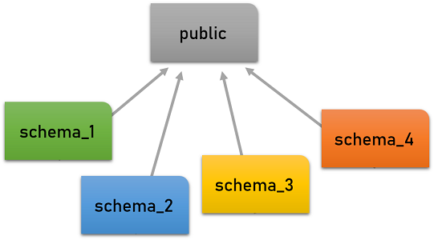

name: title
class: middle

# Of Django, PostgreSQL schemas<br/>and your multi-million dollar idea

---

layout: false
class: middle

# How the magic happens

---

layout: true

## PostgreSQL schemas

---


---



.todo[Put multiple arrows, one for each schema]

---

```python
from django.db.backends.postgresql import base as postgresql


class DatabaseWrapper(postgresql.DatabaseWrapper):
    def _cursor(self, name=None):
        # Over simplified!!!
        cursor = super()._cursor(name=name)
        tenant = get_current_tenant()
        schemas = get_schemas_from_tenant(tenant)
        search_path = ",".join(schemas)
        cursor.execute(f"SET search_path = {search_path}")
        return cursor
```

---

```python
class SchemasDatabaseRouter:

    def allow_migrate(self, db, app_label, model_name, ...):
        tenant = get_current_tenant()
        return model_belongs_to_tenant(
            app_label, model_name, tenant
        )
```

.warning[⚠️ The `migrate` command itself requires tweaking]

---

layout: false
class: middle

# Untangling the schemas

---

layout: true

## Where to put models

---

.todo[Diagram of effects of placing models in shared vs private schemas]

---

layout: true

## Where to put users

---

.todo[Diagram of free users vs bounded users]
.todo[Free users require tenant identification]
.todo[Bounded users depend on the active tenant]
.todo[Where to put sessions]

---

layout: true

## Moving models between schemas

---

.todo[The problem of using a router to control migrations]
.todo[Strategy for migrating and unmigrating]
.todo[Recommendation to operate at the level of applications and not at the level of models]

---

layout: true

## Fast tenant creation

---

.todo[The problem of migrating a schema from zero]
.todo[The reference schema for cloning]

---

layout: false
class: middle

# Plot thickens

---

layout: true

## Cross-tenant aggregations

---

.todo[The need for collecting cross-tenant data]
.todo[The problem of default IDs]
.todo[Iterative strategy]

---

layout: true

## Migrating the hundreds

---

.todo[The problem of migrating schemas]
.todo[Coordinated strategy]
.todo[Timezone based strategy]
.todo[JIT strategy]

---

layout: true

## Zero downtime deployments

---

.todo[Will the code break with your migrations?]
.todo[Coding discipline: (A) old code with new structure (B) new code with old structure]

---

layout: false
class: middle

# The good problems to have

---

layout: true

## Tables, tables and more tables

---

.todo[PostgreSQL limits of tables - theory vs practice]

```
million_tables_factor = tables_per_tenant * number_of_tenants / 10**6
```

```
scary_number_of_tenants = 10**6 / (tables_per_tenant + 2)
```

---

layout: true

## The moment of sharding

---

.todo[Logical shards]
.todo[Shared schema relations]
.todo[Routing physical shards along with schemas]

---

layout: true

## In conclusion

-   No one is de facto wrong, no one is de facto right.
-   Not aimed at a massive number of tenants.
