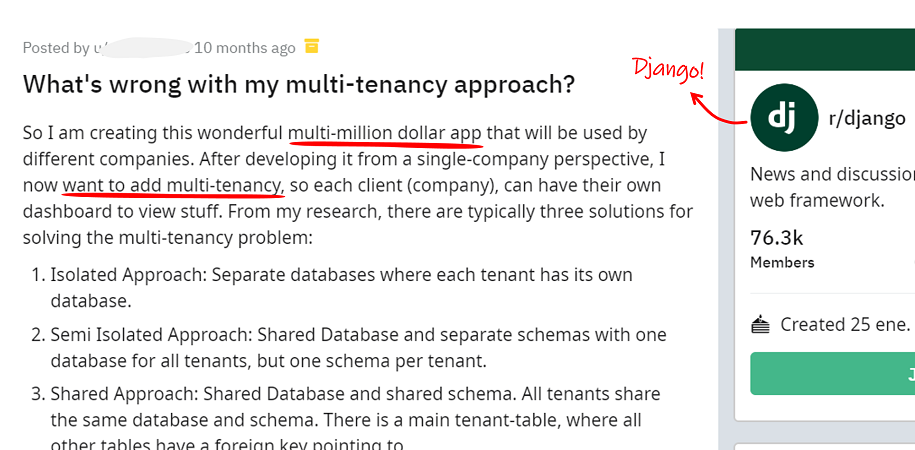
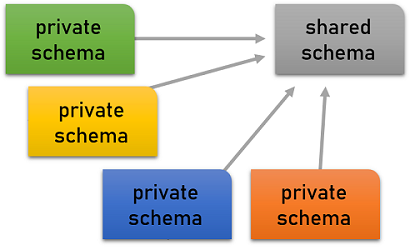
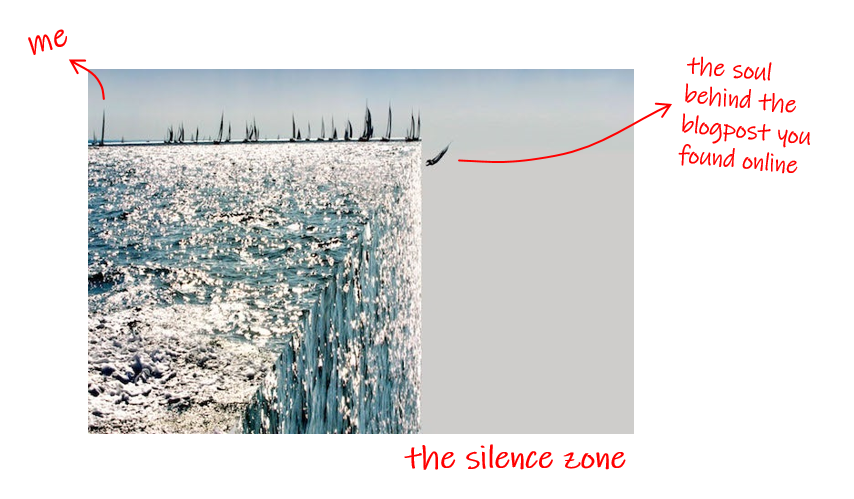

class: middle center

### Yes, this is the first slide

---

class: middle center


???

“What’s wrong with my multi-tenancy approach”, was the question in this Reddit post I found some weeks ago...

---

class: middle center



???

...from a person that was intending to create a multi-million-dollar app in Django by means of adding multi-tenancy to a previously existing single-tenant project.

---

class: middle center


???

I felt quite identified with the redditer, since I myself had the same question a couple of years ago. And, despite the fact that I took a different approach than this person, it’s true that there’s more than this mate and me out in the ocean wondering what is wrong with the path they have taken, or are about take, when it comes to multi-tenancy in Django.

---

class: middle center


???

But anyways, I now feel in a much better position to answer this mate and myself of what was wrong then and what could still be wrong today.

---

name: title
class: middle

# Of Django, PostgreSQL schemas<br/>and your multi-million dollar idea

<hr/>


???

So, if you’ve ever woken up with a multi-million-dollar idea for a multi-tenancy project in Django, and you’ve made the decision to do so through PostgreSQL schemas, this talk is definitely for you.

---

## Who am I?

.left-column-66[

##### Lorenzo Peña &middot; `lorinkoz`

-   Proud citizen of Holguín, Cuba.
-   Django developer for 11 years.
-   Open source contributor.
-   Chaser of multi-tenancy beasts.

]
.right-column-33[]

---

class: middle

.center[]

---

class: middle

.center[]

---

layout: false
class: middle

# From multi-tenancy to PostgreSQL schemas

---

layout: true

## Multi-tenancy

---

--

-   Customer .red[**red**] has a problem.

--

-   You develop a solution.

--

-   Now, customers .blue[**blue**], .green[**green**] and .yellow[**yellow**] have the same problem.

--

.left-column-66[.box[🤔 What to do?]]
.right-column-33[.right[]]

---

.center[]

---

.center[]

---

.left-column-33[
.center[ Accounts]
]

.left-column-33[
.center[ Workspaces]
]

.left-column-33[
.center[ Blogs]
]

.left-column-33[
.center[ Servers]
]

.left-column-33[
.center[ Stores]
]

.left-column-33[
.center[ Sites]
]

---

layout: false
class: middle center

.center[]

---

layout: true

## Database approaches

---

**Isolated:**<br/>Multiple databases, one per tenant.

**Shared:**<br/>One database, tables scoped by tenant.

**Semi-isolated:**<br/>One database, one PostgreSQL schema per tenant.

---

layout: true

## PostgreSQL schemas

---

.left-column-66[

##### Schemas:.ref[1]

-   Layer between database and tables.
-   Equivalent to namespaces.
-   In the face of ambiguity, precedence is set through the **search path**.

]
.right-column-33[.right[]]

.bottom[
.footnote[.ref[1] https://www.postgresql.org/docs/current/ddl-schemas.html]
]

--

```sql
SET search_path = schema_a,schema_b,public
```

---

```sql
SET search_path = schema_1,public
SET search_path = schema_2,public
...
```

.center[]

---

layout: true

## PostgreSQL schemas .green[in Django]

---

--

##### Established packages:

-   [bernardopires/django-tenant-schemas](https://github.com/bernardopires/django-tenant-schemas)
-   [tomturner/django-tenants](https://github.com/tomturner/django-tenants)

--

##### My own experimental package:

-   [lorinkoz/django-pgschemas](https://github.com/tomturner/django-pgschemas)

---

##### The three cornerstones of the packages:

--

.box[Custom database backend to set the `search_path`]

--

.box[Custom `migrate` command to operate with schemas]

--

.box[Custom database router with `allow_migrate`]

.right[▫️]

---

layout: false
class: middle

# Why schemas?

--

-   Wait, there were other options?
-   Sense of security
-   Less burden of queries
-   Customization of tenants
-   Easier backup / restore flow of tenants
-   Hype

---

layout: false
class: middle center


---

layout: false
class: middle

# Untangling the schemas

---

layout: true

## Tenants, schemas and models

---

--

##### What is the Python representation of a tenant?

--

```python
# abstract_concept.py
tenant = Tenant(schema_name="schema_1")
```

--

```python
# models.py
class Tenant(models.Model):
    schema_name = models.CharField(unique=True, ...)
```

---

.box[💡 All tenants have an associated schema]

--

.box[🤚 Not all schemas have a corresponding tenant]

--

.center[]

---

```python
# settings.py

SHARED_APPS = [...]
TENANT_APPS = [...]

INSTALLED_APPS = SHARED_APPS + TENANT_APPS

```

--

.box[🤔 Why at the app level and not at the model level?]

---

##### Tenant (private) models

.left-column[]
.right-column[

-   Tenant specific models
-   Customizable catalogs
    ]

---

##### Shared models

.left-column[]
.right-column[

-   Immutable catalogs
-   Cached aggregations
-   Content-types (in general)
-   High volume writes
    ]

---

##### Duplicated (hidden) models

.left-column[]
.right-column[

-   Django migrations
-   Other meta models
    ]

---

layout: true

## Where to put users?

---

--


--

.left-column[.center[]]
.right-column[.center[]]

---

##### Bound users

.right-column-66[]
.left-column-33[]
.left-column-33[
Require an active tenant
]

---

##### Free users

.right-column-66[]
.left-column-33[]
.left-column-33[
Require database binding with tenants
]

---

##### .red[Careful with database sessions!]

`django.contrib.sessions`

-   Source of leaking authentication.
-   Must be equally strict or more strict than users.

--

.box[🦉 Keep them together with users]

---

layout: true

## Moving models between schemas

---

--

We are using the `allow_migrate` of a database router.

--

.box[💡 Migrations are still recorded as being applied]

--

.warning[⚠️ Migrations must be unapplied and applied again]

---

##### Strategy:

-   Unapply migrations of the app.
-   Change "app to schema" configuration.
-   Apply migrations of the app.

---

##### .red[What if there is data?]

-   Hard to do with migrations.
-   Search path hides the tables.
-   Recommended with some form of export / import.

--

.box[💡 Avoid whenever possible]

---

layout: false
class: middle center


---

layout: false
class: middle

# The plot thickens

---

layout: true

## Tenant creation is slow

---

--

##### Why?

-   Schema creation implies running all migrations from zero.
-   Migrations are not necessarily optimal.
-   Migrations can take time.
-   Additional data initialization can take time.

--

.box[💡 Provision a special schema for cloning]

---

layout: true

## You know what else is slow?

---

---

.left[]

---

.left-column-66[]

--

.right-column-33[

##### Possible strategies:

-   Sequential
-   In parallel
-   By time-zone
-   Just-in-time

]

---

layout: true

## Zero downtime deployments

---

--

.box[🦉 Make your code resilient]

--

##### Culture:

-   Embrace multi-phase deployments.
-   Always make migrations reversible.
-   Be prepared to reverse migrations.

---

##### Strategy:

-   Change code to handle both old and new structure.
-   Mutate structure.
-   Update code for new structure alone.

--

.box[💪 Work out the multi-phase deployment muscle]
.center[]

---

layout: true

## Cross-tenant aggregations

---

.center[]

---

##### Strategy:

-   Iterate through tenants.
-   Background job with cached results.

---

##### .red[Careful with IDs!]

-   Repeated across tenants.
-   Don't guarantee uniqueness.

--

.box[💡 Use global identifiers in addition to local IDs]

---

layout: false
class: middle center

.center[]

---

layout: false
class: middle

# Beware of the behemoth

---

layout: true

## Tables, tables and more tables

---

--

There is no .strike[practical] theoretical limit on the number of tables in a given database..ref[1]

.bottom[
.footnote[.ref[1] https://www.postgresql.org/message-id/53386E0C47E7D41194BB0002B325C997747F2B@NTEX60]
]

--

.red[In theory, theory is enough, but practice shows otherwise.]

--

.warning[⚠️ There is a practical limit!]

---

##### Million tables factor

--

.center[]

.box[🐍 `tables_per_tenant \* number_of_tenants / 10\*\*6`]

---

.right[

|            | 50   | 100  | 500  | 1k   | 5k          | 10k        | 50k         | 100k        |
| ---------- | ---- | ---- | ---- | ---- | ----------- | ---------- | ----------- | ----------- |
| .bold[50]  | 0.00 | 0.01 | 0.03 | 0.05 | 0.25        | 0.50       | .red[2.50]  | .red[5.00]  |
| .bold[100] | 0.01 | 0.01 | 0.05 | 0.10 | 0.50        | .red[1.00] | .red[5.00]  | .red[10.00] |
| .bold[150] | 0.01 | 0.02 | 0.08 | 0.15 | .emph[0.75] | .red[1.50] | .red[7.50]  | .red[15.00] |
| .bold[200] | 0.01 | 0.02 | 0.10 | 0.20 | .red[1.00]  | .red[2.00] | .red[10.00] | .red[20.00] |
| .bold[250] | 0.01 | 0.03 | 0.13 | 0.25 | .red[1.25]  | .red[2.50] | .red[12.50] | .red[25.00] |
| .bold[300] | 0.02 | 0.03 | 0.15 | 0.30 | .red[1.50]  | .red[3.00] | .red[15.00] | .red[30.00] |

]

.bottom[
.footnote[Columns are number of tenants, rows are number of tables, intersection shows the million tables factor for the given row and column.]
]

---

##### Scary number of tenants

.center[]

.box[🐍 `10\*\*6 / tables_per_tenant`]

---

.box[💡 Not a Django-specific problem]

--

.box[🦉 Schema-related behemoths are not that massive]

---

layout: false
class: middle center



---

layout: true

## What if we shard?

---

--

##### Sharding:

Horizontal partitioning of data.

-   Physical shards
-   Logical shards

Logical shards are mapped to physical shards.

---

.box[🤓 Let's try it in the Django side]

--

##### Strategy:

-   Schemas will be the minimum decomposable unit.
-   Physical shards must be routed along with schemas.

--

```python
tenant = Tenant(schema_name="schema_1", logical_shard=1)

database = get_physical_shard_from_tenant(tenant)

```

---

```python
class ShardedSchemasDatabaseRouter:

    def db_for_read(model, ...):
        # Physical shard as default value
        ...

    def db_for_write(model, ...):
        # Physical shard as default value
        ...

    def allow_migrate(self, db, app_label, model_name, ...):
        # Same implementation of the selected package
        ...
```

.bottom[
.footnote[https://github.com/lorinkoz/django-pgschemas/pull/41]
]

---

##### What to do with .emph[shared] apps?

.warning[⚠️ No cross-database relations allowed]

--

-   Keep shared apps synchronized across physical shards.
-   Let go referential integrity between private and shared apps.

--

.warning[⚠️ Extra care with free users]

---

.center[]

---

layout: false
class: middle center

### .red[What if, after all, schemas were not enough?]

--


---

layout: true

## The moment of .red[chaos]

---

---

##### Some say:

> When you find out schemas are not enough, you should have enough money to afford a rewrite.

##### But remember:

> Sensible people will see trouble coming and avoid it,
> but an unthinking person will walk right into it and regret it later.
> (Proverbs 22:3 GNT)

---

layout: false
class: middle center


---

layout: false
class: middle

# In conclusion

---

## Is multi-tenancy through schemas de-facto wrong?

<br/>

--

# .green[No]

---

## Should you use schemas in your next SaaS project?

<br/>

--

# .green[Run the numbers]

---

## Should you change your database architecture right away?

<br/>

--

# .green[It depends]

--

### .green[Run the numbers - don't panic]

--

### .green[There are ways to smartly transition]

---

layout: false

## Just in case

##### Alternative packages for shared database:

-   [citusdata/django-multitenant](https://github.com/citusdata/django-multitenant)
-   [raphaelm/django-scopes](https://github.com/raphaelm/django-scopes)

---

layout: false

## And that's it!

##### Want do discuss more?

|         |                                                    |
| ------- | -------------------------------------------------- |
| Twitter | [@lorinkoz](https://twitter.com/lorinkoz)          |
| GitHub  | [github.com/lorinkoz](https://github.com/lorinkoz) |
| Email   | [lorinkoz@gmail.com](mailto:lorinkoz@gmail.com)    |

.right[]

---

template: title
