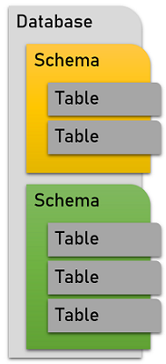

name: title
class: middle

# Of Django, PostgreSQL schemas<br/>and your multi-million dollar idea

---

layout: false
class: middle

# How the magic happens

---

layout: true

## Database approaches

---

---

layout: true

## The active tenant

---

---

layout: true

## PostgreSQL schemas

---



---

.left-column[

]

.right-column[

```sql
SET search_path = tenant1,shared
SET search_path = tenant2,shared
```

]

---

```python
from django.db.backends.postgresql import base as postgresql


class DatabaseWrapper(postgresql.DatabaseWrapper):
    def _cursor(self, name=None):
        # Over simplified!!!
        cursor = super()._cursor(name=name)
        tenant = get_current_tenant()
        schemas = get_schemas_from_tenant(tenant)
        search_path = ",".join(schemas)
        cursor.execute(f"SET search_path = {search_path}")
        return cursor
```

---

```python
class SchemasDatabaseRouter:

    def allow_migrate(self, db, app_label, model_name, ...):
        tenant = get_current_tenant()
        return `model_belongs_to_tenant`(
            app_label, model_name, tenant
        )
```

.warning[⚠️ The `migrate` command itself requires tweaking]

---

layout: false
class: middle

# Untangling the schemas

---

layout: true

## Arranging schemas

---

.todo[Diagram of effects of placing models in shared vs private schemas]

---

```python
# settings.py

SHARED_APPS = [...]
TENANT_APPS = [...]

INSTALLED_APPS = SHARED_APPS + TENANT_APPS

```

.box[Why at the app level and not at the model level?]

---

.box[Where to store the tenant catalog?]

---

layout: true

## Where to put users

---

.todo[Diagram of free users vs bound users]
.todo[Diagram of placement of each type of user]

---

.left-column[

#### Free users:

-   Require tenant binding via database.
-   Possibly define the active tenant.

]

.right-column[

#### Bound users:

-   Require an active tenant.

]

---

#### Careful with database sessions:

-   Source of leaking authentication.
-   Must be equally or more strict than users.

.box[Keep them together with the app of users]

---

layout: true

## Careful with content types

---

`django.contrib.contenttypes`

#### Helpful for:

-   Generic relations
-   Polymorphism.ref[1]
-   Other unnamed wizardries

---

.left-column[

#### Free ctypes:

-   Consistent across tenants.

]

.right-column[

#### Bound ctypes:

-   Portable with tenants
-   Requires clearing the content types cache when setting the active tenant.

]

---

layout: true

## Moving models between schemas

---

We are using the `allow_migrate` of a database router.

.warning[Migrations are still recorded as being applied]
.warning[Moving models between schemas implies applying migrations again]

---

#### Strategy:

-   Unapply migrations of the app.
-   Change app to schema configuration.
-   Apply migrations of the app.

.box[This is why we operate at the application level]

---

#### What if there is data?

-   Search path hides the tables.
-   Hard to do with migrations.
-   Recommended with some form of export / import.

.box[Avoid whenever possible]
.box[Carefully design your data layer]

---

layout: false
class: middle

# The plot thickens

---

layout: true

## Fast tenant creation

---

#### By default:

-   Schema creation implies running all migrations from zero.
-   Migrations are not necessarily optimal.
-   Migrations can take time.
-   Additional data initialization can take time.

---

.box[An extra schema for cloning]

-   Keep it up to date with structure.
-   Keep it up to date with initial data.

---

layout: true

## Cross-tenant aggregations

---

.todo[Meme of dashboard]

---

#### Strategy:

.box[Iterate, of course]

.todo[Meme of huge set of drawers]

---

#### Careful with IDs:

-   Repeated across tenants
-   Don't guarantee uniqueness

.box[Use global identifiers in addition to regular IDs]

---

layout: true

## Migrating the hundreds

---

.todo[Same meme of set of drawers]
.todo[Meme of crazy lady, cat and migrations]

---

#### Possible strategies:

-   Coordinated
-   Time-zone clustered
-   Just-in-time migration

---

layout: true

## Zero downtime deployments

---

.box[Migrations will take time]
.box[Make your code resilient]

---

#### Culture:

-   Embrace multi-phase deployments.
-   Always make migrations reversible.

---

#### Strategy:

-   Change code to handle both old and new structure.
-   Mutate structure.
-   Update code for new structure alone.

---

layout: false
class: middle

# The good problems to have

---

layout: true

## Tables, tables and more tables

---

.box[In theory, theory is enough, but practice shows otherwise]

.box[The number of tables is not imposed by PostgreSQL]

.warning[There is a practical limit!]

---

```
million_tables_factor = tables_per_tenant * number_of_tenants / 10**6
```

```
scary_number_of_tenants = 10**6 / tables_per_tenant
```

---

layout: true

## The moment of sharding

---

#### Logical shards

-   Schemas will be your minimum decomposable unit.
-   Assign them logical shards in powers of 2.
-   Physical shards must be routed along with schemas.

---

#### What to do with shared apps?

.warning[No cross-database relations allowed.]

-   Sync shared apps across physical shards.
-   Don't have relations with shared apps.

.warning[Extra care with free users]

---

layout: true

## When schemas hit the fan

---

What if, after all, schemas were not enough?

.todo[Meme of chaos]

---

template: title
