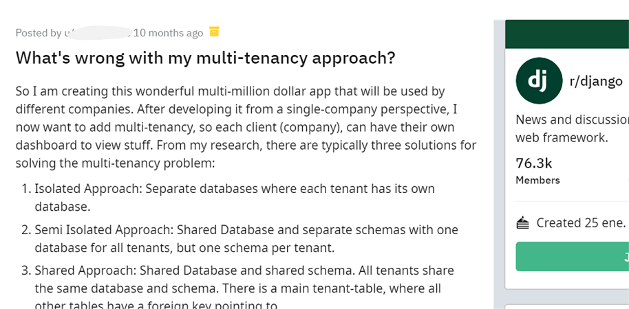
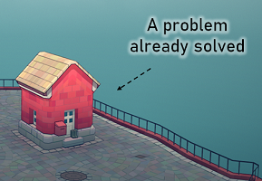
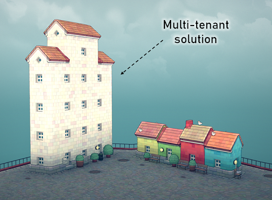
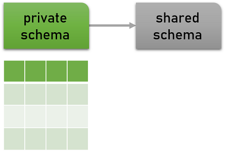
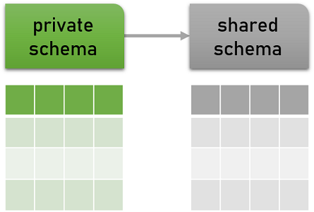
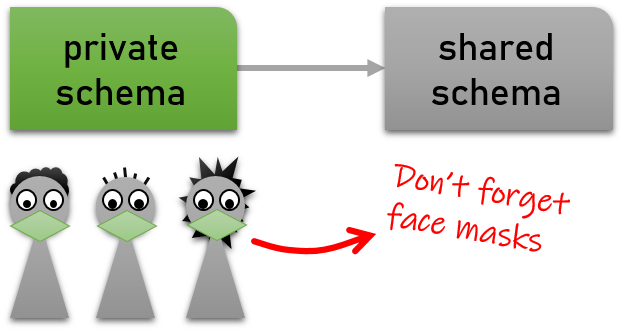
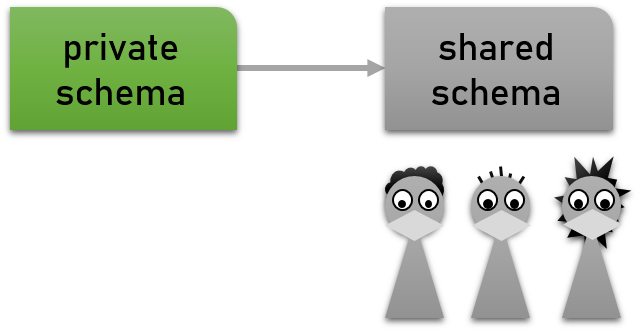
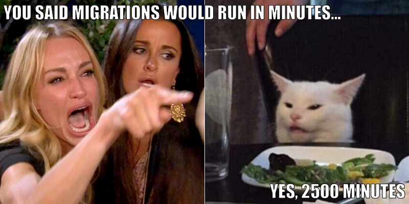
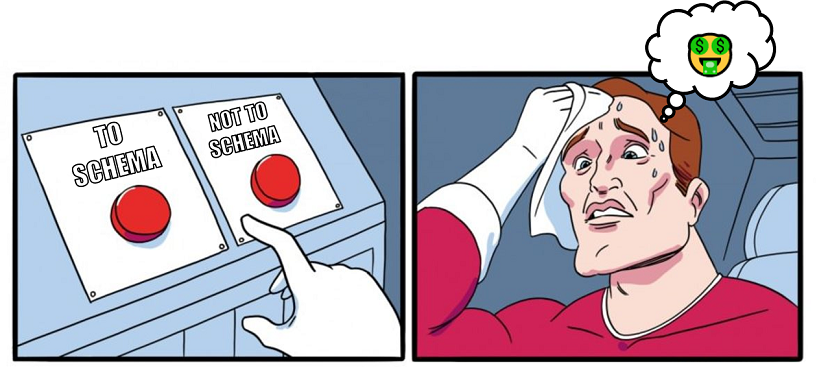

<!-- nothing -->

---

class: middle center



---

class: middle center


---

class: middle center


---

class: middle center


---

name: title
class: middle

# Of Django, PostgreSQL schemas<br/>and your multi-million dollar idea

<hr/>


---

## Who am I?

.left-column-66[

##### Lorenzo Peña

-   Proud citizen of Holguín, Cuba.
-   Django developer for 11 years.
-   Chaser of multi-tenancy beasts.

]
.right-column-33[]

---

class: middle

.center[]

---

class: middle

.center[]

---

layout: false
class: middle

# From multi-tenancy to<br/>PostgreSQL schemas in Django

---

layout: true

## Multi-tenancy

---

--

-   Customer .red[**red**] has a problem.

--

-   You develop a solution.

--

-   Now, customers .blue[**blue**], .green[**green**] and .yellow[**yellow**] have the same problem.

--

.left-column-66[.box[🤔 What to do?]]
.right-column-33[.right[]]

---

.center[]

---

.center[]

---

.left-column-33[
.center[ Workspaces]
]

.left-column-33[
.center[ Accounts]
]

.left-column-33[
.center[ Blogs]
]

.left-column-33[
.center[ Servers]
]

.left-column-33[
.center[ Stores]
]

.left-column-33[
.center[ Sites]
]

---

layout: false
class: middle center

.center[]

---

layout: true

## Database approaches

---

**Isolated:**<br/>Multiple databases, one per tenant.

**Shared:**<br/>One database, tables scoped by tenant.

**Semi-isolated:**<br/>One database, one PostgreSQL schema per tenant.

---

layout: true

## PostgreSQL schemas

---

.left-column-66[

##### Schemas:.ref[1]

-   Layer between database and tables.
-   Equivalent to namespaces.
-   In the face of ambiguity, precedence is set through the **search path**.

]
.right-column-33[.right[]]

.bottom[
.footnote[.ref[1] https://www.postgresql.org/docs/current/ddl-schemas.html]
]

--

```sql
SET search_path = schema_a,schema_b,public
```

---

```sql
SET search_path = schema_1,public
SET search_path = schema_2,public
...
```

.center[]

---

layout: true

## PostgreSQL schemas .green[in Django]

---

--

##### Established packages:

-   [bernardopires/django-tenant-schemas](https://github.com/bernardopires/django-tenant-schemas)
-   [tomturner/django-tenants](https://github.com/tomturner/django-tenants)

--

##### My own experimental package:

-   [lorinkoz/django-pgschemas](https://github.com/tomturner/django-pgschemas)

---

##### The three cornerstones of the packages:

--

.box[Custom database backend to set the `search_path`]

--

.box[Custom `migrate` command to operate with schemas]

--

.box[Custom database router with `allow_migrate`]

---

layout: false
class: middle

--

# Why schemas?

--

-   Wait, there were other options?
-   Sense of security
-   Less burden of queries
-   Customization of tenants
-   Easier backup / restore flow of tenants
-   Hype

---

layout: false
class: middle center


---

layout: false
class: middle

# Untangling the schemas

---

layout: true

## Tenants, schemas and models

---

--

##### What is the Python representation of a tenant?

--

```python
# abstract_concept.py
tenant = Tenant(schema_name="schema_1")
```

--

```python
# models.py
class Tenant(models.Model):
    schema_name = models.CharField(unique=True, ...)
```

---

.box[💡 All tenants have an associated schema]

--

.box[🤚 Not all schemas have a corresponding tenant]

--

.center[]

---

```python
# settings.py

SHARED_APPS = [...]
TENANT_APPS = [...]

INSTALLED_APPS = SHARED_APPS + TENANT_APPS

```

--

.box[🤔 Why at the app level and not at the model level?]

---

##### Tenant (private) models

.left-column[]
.right-column[

-   Tenant specific models
-   Customizable catalogs
    ]

---

##### Shared models

.left-column[]
.right-column[

-   The tenant catalog
-   Read-only catalogs
-   System-wide data
-   Cached aggregations
-   High volume writes
    ]

---

##### Duplicated (hidden) models

.left-column[]
.right-column[

-   Django migrations
-   Content types.ref[1]
-   Other meta models
    ]

.bottom[
.footnote[.ref[1] With known side effects]
]

---

layout: true

## Where to put users?

---

--


--

.left-column[.center[]]
.right-column[.center[]]

---

##### Bound users

.right-column-66[]
.left-column-33[]
.left-column-33[
Require an active tenant
]

---

##### Free users

.right-column-66[]
.left-column-33[]
.left-column-33[
Require database binding with tenants
]

---

##### .red[Careful with database sessions!]

`django.contrib.sessions`

-   Source of leaking authentication.
-   Must be equally strict or stricter than users.

--

.box[🦉 Keep them together with users]

---

layout: true

## Moving models between schemas

---

--

We are using the `allow_migrate` of a database router.

--

.box[💡 Migrations are still recorded as being applied]

--

.warning[⚠️ Migrations must be reapplied differently]

---

##### Strategy:

-   Unapply migrations of the app.
-   Change "app to schema" configuration.
-   Apply migrations of the app again.

--

.box[🦉 Avoid having data before you have a stable layout]

---

layout: false
class: middle center


---

layout: false
class: middle

# The plot thickens

---

layout: true

## Tenant creation is slow

---

--

##### Why?

-   Schema creation implies running all migrations from zero.
-   Migration history is not necessarily optimal.
-   Additional data initialization can take time.

--

.box[💡 Provision a special schema for cloning]

---

layout: true

## You know what else is slow?

---

---

.left[]

---

.left-column-66[]

--

.right-column-33[There are strategies to reduce the time...<br/><br/>]

--

.right-column-33[.warning[Migrations will still be slow!]]

---

layout: true

## Zero downtime deployments

---

--

.box[🦉 Make your code resilient]

--

##### Culture:

-   Embrace multi-phase deployments.
-   Always make migrations reversible.
-   Be prepared to reverse migrations.

---

##### Strategy:

-   Change code to handle both old and new DB structure.
-   Mutate DB structure.
-   Update code for new DB structure alone.

--

.box[💪 Work out the multi-phase deployment muscle]
.center[]

---

layout: true

## Other middle-term challenges

---

---

-   Data recollection across tenants.
-   Backup / restore flow of tenants with free users.
-   What to do with unique, general purpose tenants like a master site, a blog or the help center.

--

.center[]

---

layout: false
class: middle center

.center[]

---

layout: false
class: middle

# The size of the behemoth

---

layout: true

## Tables, tables and more tables

---

--

There is no practical limit on the number of tables a PostgreSQL database can have..ref[1]

.bottom[
.footnote[.ref[1] https://www.postgresql.org/message-id/53386E0C47E7D41194BB0002B325C997747F2B@NTEX60]
]

--

.warning[⚠️ But there is a practical limit!]

---

.emph[A million] is a scary number of tables to have in a single database.

--

.left-column-66[]

--

.right-column-33[

.center[

| T   | S    |
| --- | ---- |
| 50  | 20k  |
| 100 | 10k  |
| 150 | 6.7k |
| 200 | 5k   |

]
]

---

.box[💡 Not a Django-specific problem]

--

.box[🦉 Schema-related behemoths are not that massive]

---

layout: true

## Why don't we shard?

---

--

.center[]

---

.box[🤓 Let's try it in the Django side]

--

##### Strategy:

-   Schemas must be the minimum decomposable unit.
-   Physical shards must be routed along with schemas.

--

```python
tenant = Tenant(schema_name="schema_1", `logical_shard=1`)

database = `get_physical_shard_from_tenant`(tenant)

```

---

```python
class ShardedSchemasDatabaseRouter:

    def `db_for_read`(model, ...):
        # Physical shard as default value
        ...

    def `db_for_write`(model, ...):
        # Physical shard as default value
        ...

    def allow_migrate(self, db, app_label, model_name, ...):
        # Same implementation of the selected package
        ...
```

.bottom[
.footnote[https://github.com/lorinkoz/django-pgschemas/pull/41]
]

---

.warning[⚠️ There are now multiple shared schemas]

--

.warning[⚠️ For free users, what to do?]

---

.center[]

---

layout: false
class: middle center

### .red[What if, after all, schemas are not enough?]

--


---

layout: true

## The moment of .red[chaos]

---

---

##### Some say:

> When you find out schemas are not enough, you should have enough money to afford a rewrite.

##### But remember:

> Sensible people will see trouble coming and avoid it,
> but an unthinking person will walk right into it and regret it later.
> (Proverbs 22:3 GNT)

---

layout: false
class: middle center



---

layout: false
class: middle

# In conclusion

---

## Is multi-tenancy through schemas de facto wrong as a choice?

<br/>

--

# .green[Absolutely not]

---

## Should you use schemas in your next SaaS project?

<br/>

--

# .green[Why schemas?]

--

# .green[Run the numbers]

---

## Should you change your database architecture to something other than schemas?

<br/>

--

# .green[Would you have used a different architecture should your project have started today?]

--

### .green[Don't panic - There are ways to smartly transition]

---

class: middle center

# 🦉

## .blue[Make your informed decision .emph[with a cold head]]

---

layout: false

## Just in case

##### Alternative packages for shared database:

-   [citusdata/django-multitenant](https://github.com/citusdata/django-multitenant)
-   [raphaelm/django-scopes](https://github.com/raphaelm/django-scopes)

---

layout: false

## And that's it!

##### Want do discuss more?

|         |                                                    |
| ------- | -------------------------------------------------- |
| Twitter | [@lorinkoz](https://twitter.com/lorinkoz)          |
| GitHub  | [github.com/lorinkoz](https://github.com/lorinkoz) |
| Email   | [lorinkoz@gmail.com](mailto:lorinkoz@gmail.com)    |

.center[]

---

template: title
